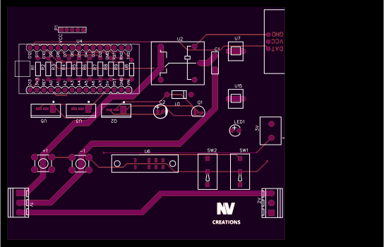
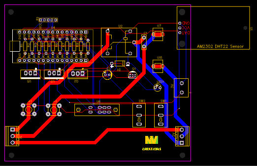
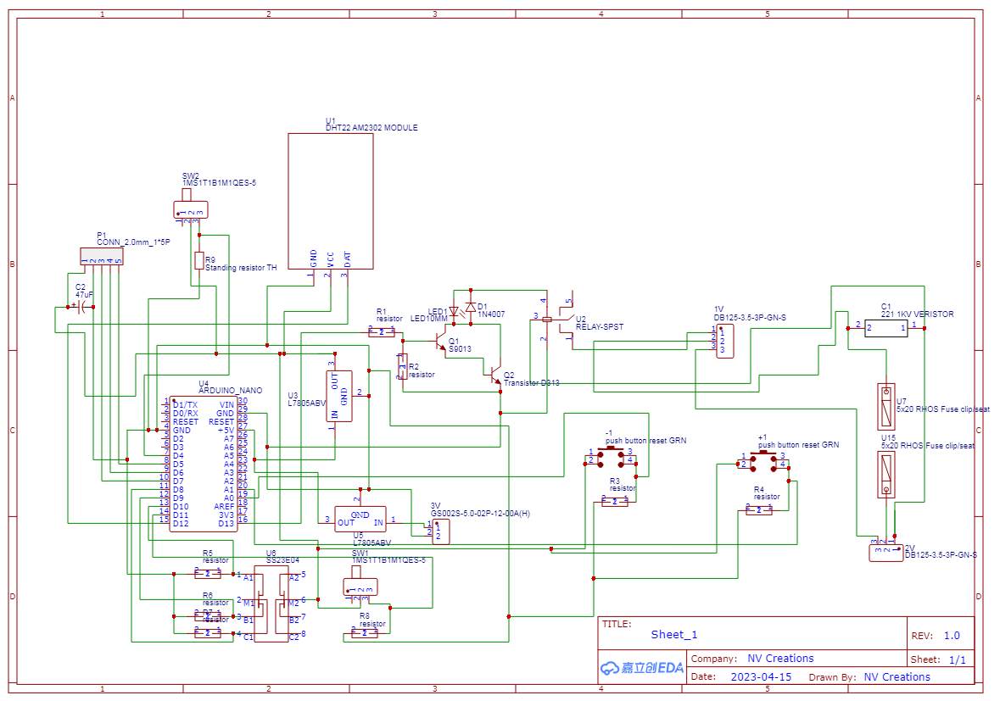

# NV-SmartEnv-7Seg

An advanced, compact, and PC-independent Arduino-based environmental monitoring module designed to display temperature and humidity using a MAX7219-based 7-segment display.

This is a segment-display variant of the original [NV-SmartEnv-Controller](https://github.com/NVCreations33/NV-SmartEnv-Controller), built with all of its core capabilities and safety measures — but optimized for numeric output.

---

## 🖼️ Previews

| Top View | PCB Layout | Schematic |
|----------|------------|-----------|
|  |  |  |

---

## 📦 What's Included

- 📄 **Arduino Code** – The full working program
- 🖼️ **PCB_Layout.png** – PCB design snapshot
- 📐 **Top_View.svg** – Top-down circuit view
- ⚡ **Schematic_Diagram.png** – Schematic diagram
- 💾 **Gerber_Files.zip** – Production-ready PCB files
- 🧰 **Design.json** – EasyEDA source file
- 📑 **LICENSE** – CC BY 4.0 license file

---

## 💡 Features

- 🌡️ Measures temperature and humidity
- 📊 Displays values on 7-segment display via **MAX7219**
- 🔧 Customizable temperature/humidity thresholds via onboard buttons
- 🖥️ **No PC required** after uploading — fully programmable via buttons
- 🔌 Can switch external devices ON/OFF at certain conditions
- 🚨 Built-in safety features
- 🔁 Ideal for use in **automation, hobbyist, or remote setups**
- 🔄 Easily adaptable for other projects (RC cooling, fans, etc.)

---

## 🧩 Compatibility

This controller is compatible with **any MAX7219-based 7-segment module**, including:
- NV-MAX7219-LargeSeg
- Commercial 0.36" and 0.56" display modules
- Custom MAX7219 breakout boards

---

## 🧾 License

This project is licensed under the [Creative Commons Attribution 4.0 International (CC BY 4.0)](LICENSE).  
You are free to use, share, adapt, and even commercialize this work, provided that appropriate credit is given.

---

## 💼 Freelance Adaptability

This version is optimized for use cases where space, simplicity, or numeric data output is preferred over alphanumeric LCD displays. I offer:
- 🔧 Custom pin configurations
- 📐 PCB resizing
- 🔄 Display adjustments
- ⚙️ Firmware tweaks

For freelance customization, feel free to [contact me through GitHub](https://github.com/YOUR_USERNAME).

